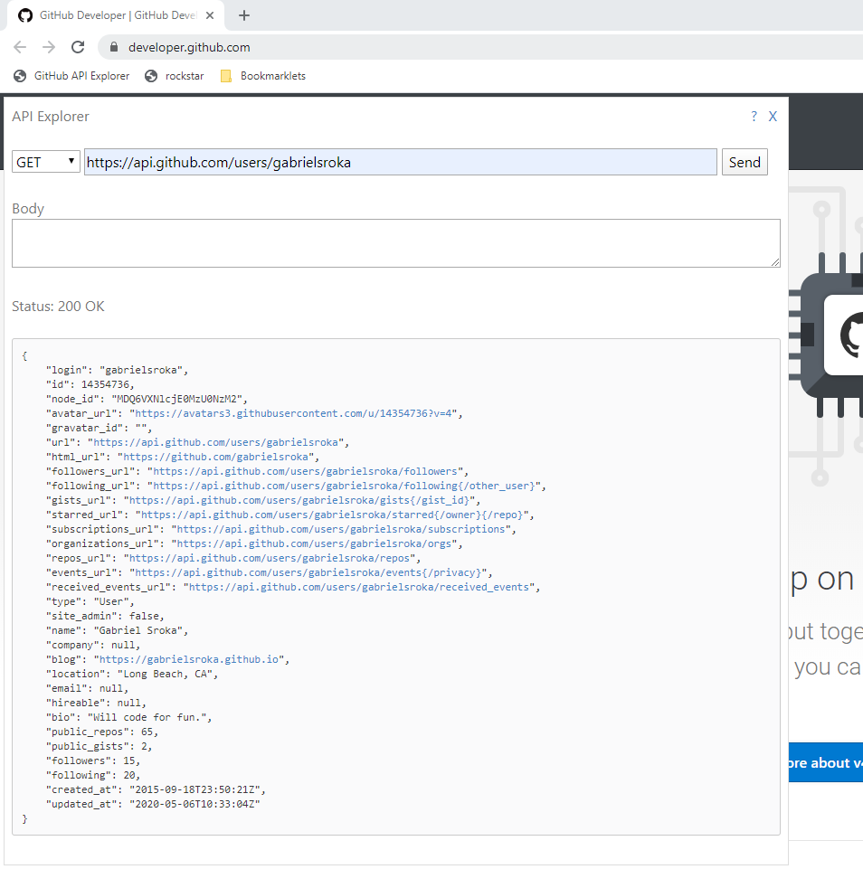

# Explore the GitHub API

A short (100-line) JavaScript snippet to call the GitHub API from a browser UI -- like a mini-Postman.

It runs in your browser like a browser extension. In fact, it can easily be turned into a browser extension.

# Setup
1. Show your bookmarks toolbar. In Chrome, ... > Bookmarks > Show Bookmarks Bar. In Firefox, right-click in the title bar and click Bookmarks Toolbar.
2. Drag this to the bookmarks toolbar:
<a href='javascript:(function(){document.body.appendChild(document.createElement("script")).src="https://gabrielsroka.github.io/GitHubAPIExplorer.js";})();'>GitHub API Explorer</a>

# Usage
1. Navigate your browser to [https://developer.github.com](https://developer.github.com)
2. Click the GitHub bookmark from your toolbar.

# Alternative Setup
Copy this code to the browser console, or, if using Chrome, to a Snippet. For example:
1. Press F12 (Windows) to open DevTools.
2. Go to Sources > Snippets, click New Snippet.
3. Give it a name, eg, "GitHub API Explorer".
4. Copy/paste the code from [https://gabrielsroka.github.io/GitHubAPIExplorer.js](https://gabrielsroka.github.io/GitHubAPIExplorer.js)
5. Save (Ctrl+S, Windows).

# Alternative Usage
1. Navigate your browser to [https://developer.github.com](https://developer.github.com)
2. Press F12 (Windows) to open DevTools.
3. Run the code. If using a Snippet, there's a Run button on the bottom right, or press Ctrl+Enter (Windows).
4. Look for the popup window in the upper-left corner of your browser.

Check out [GitHubAPIExplorer.js](https://gabrielsroka.github.io/GitHubAPIExplorer.js)

[Source Code](https://github.com/gabrielsroka/gabrielsroka.github.io/blob/master/GitHubAPIExplorer.js)

# Why?
I've long been fascinated by the abillity to run arbitrary JavaScript against a website. This can be something simple, like scraping HTML. Or adding a "missing feature" to a website. I started this around 15 years ago when I was using a time tracking website, but I found it tedious and error-prone. I was able to automate data entry with a simple piece of JavaScript.

Now I write more complex scripts like this one. I can add HTML/CSS popups and power them with JavaScript.

Browsers have gotten better at this, too. Chrome, for example, has a fairly complete set of [developer tools](https://developers.google.com/web/tools/chrome-devtools) for writing and debugging JavaScript.

There are a few options for running your JavaScript on someone else's website:
- the address bar using the `javascript:` scheme. For example, `javascript:alert('hi')` [1]. Note that some browsers remove the `javascript:` part if you paste it in, and some browsers or sites block these.
- bookmarklets - like regular bookmarks, but they can run JavaScript [2]. These even work on mobile (which doesn't have a Dev Console)! You can host them on sites like GitHub so you can share them, update them, etc. For example, `javascript:(function(){document.body.appendChild(document.createElement("script")).src= "https://gabrielsroka.github.io/GitHubAPIExplorer.js";})();`
- [Chrome DevTools console](https://developers.google.com/web/tools/chrome-devtools/console) [3]
- [Chrome Snippets](https://developers.google.com/web/tools/chrome-devtools/javascript/snippets) [4]
- [Greasemonkey](https://addons.mozilla.org/en-US/firefox/addon/greasemonkey/) user scripts
- [Chrome](https://developer.chrome.com/extensions) or [Firefox](https://developer.mozilla.org/en-US/Add-ons/WebExtensions) browser extensions

[1] Address Bar

[2] Bookmarklet

[3] Chrome DevTools Console

[4] Chrome Snippets

