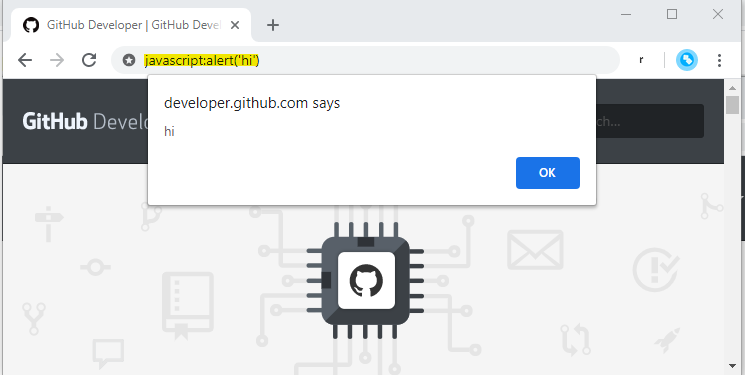
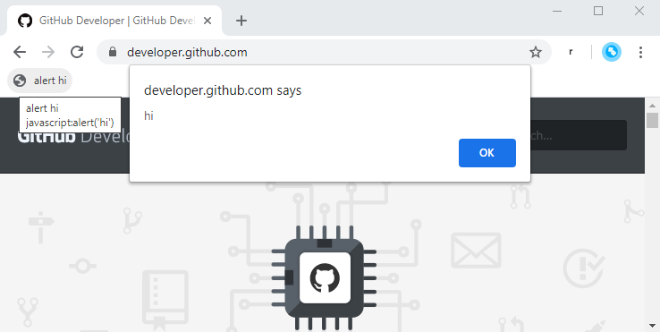
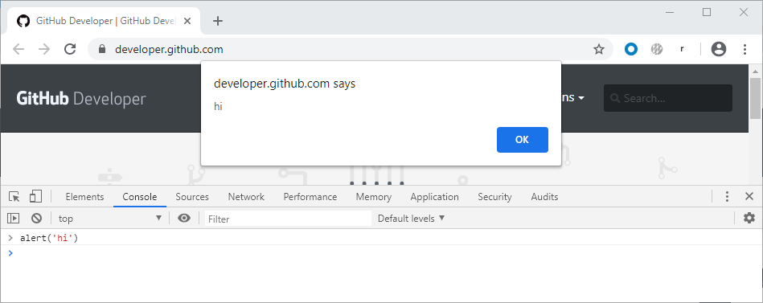
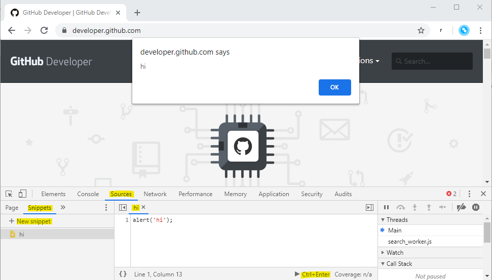

# SearchGroups.js

A short (25-line) JavaScript snippet to call the Okta API from a browser UI -- like a mini-rockstar.

# Setup
1. Show your bookmarks toolbar. In Chrome, ... > Bookmarks > Show Bookmarks Bar. In Firefox, right-click in the title bar and click Bookmarks Toolbar.
2. Drag all of [https://gabrielsroka.github.io/SearchGroups.js](https://gabrielsroka.github.io/SearchGroups.js) to the bookmarks toolbar.

Or, copy this code to the browser Console, or, if using Chrome, to a Snippet:
1. Press F12 (Windows) to open DevTools.
2. Go to Sources > Snippets, click New Snippet.
3. Give it a name, eg, "SearchGroups".
4. Copy/paste the code from [https://gabrielsroka.github.io/SearchGroups.js](https://gabrielsroka.github.io/SearchGroups.js)
5. Save (Ctrl+S, Windows).

# Usage
1. Navigate your browser to your Okta admin console.
2. Press F12 (Windows) to open DevTools.
3. Run the code. Click the bookmarklet, or if using a Snippet, there's a Run button on the bottom right, or press Ctrl+Enter (Windows).
4. Look for the popup window in the upper-left corner of your browser.

Check out the [Source Code](https://github.com/gabrielsroka/gabrielsroka.github.io/blob/master/SearchGroups.js)

# Why?
I've long been fascinated by the abillity to run arbitrary JavaScript against a website. This can be something simple, like scraping HTML. Or adding a "missing feature" to a website. I started learning about this around 15 years ago when I was using a time tracking website, but I found it tedious and error-prone. I was able to automate data entry with a simple piece of JavaScript.

Now I write more complex scripts like this one. I can add HTML/CSS popups and power them with JavaScript.

Browsers have gotten better at this, too. Chrome, for example, has a fairly complete set of [DevTools](https://developer.chrome.com/docs/devtools/) for writing and debugging JavaScript.

# How
There are a few options for running your JavaScript on someone else's website:
- the address bar using the `javascript:` scheme. For example, `javascript:alert('hi')` [1]. Note that some browsers remove the `javascript:` part if you paste it in, and some browsers or sites block these.
- bookmarklets - like regular bookmarks, but they can run JavaScript [2]. These even work on mobile browsers, which usually don't have DevTools! You can host them on sites like GitHub so you can share them, update them, etc. For example, drag this to your bookmark toolbar, then click it: 
```js
javascript:
(function () {
  alert('hi');
})(); //Say Hi
```
- [Chrome DevTools console](https://developer.chrome.com/docs/devtools/console/) [3]
- [Chrome Snippets](https://developer.chrome.com/docs/devtools/javascript/snippets/) [4]
- [Greasemonkey](https://addons.mozilla.org/en-US/firefox/addon/greasemonkey/) user scripts
- [Chrome](https://developer.chrome.com/docs/extensions/) or [Firefox](https://developer.mozilla.org/en-US/Add-ons/WebExtensions) browser extensions

<br>
[1] Address Bar



<br>
[2] Bookmarklet



<br>
[3] Chrome DevTools Console



<br>
[4] Chrome Snippet


